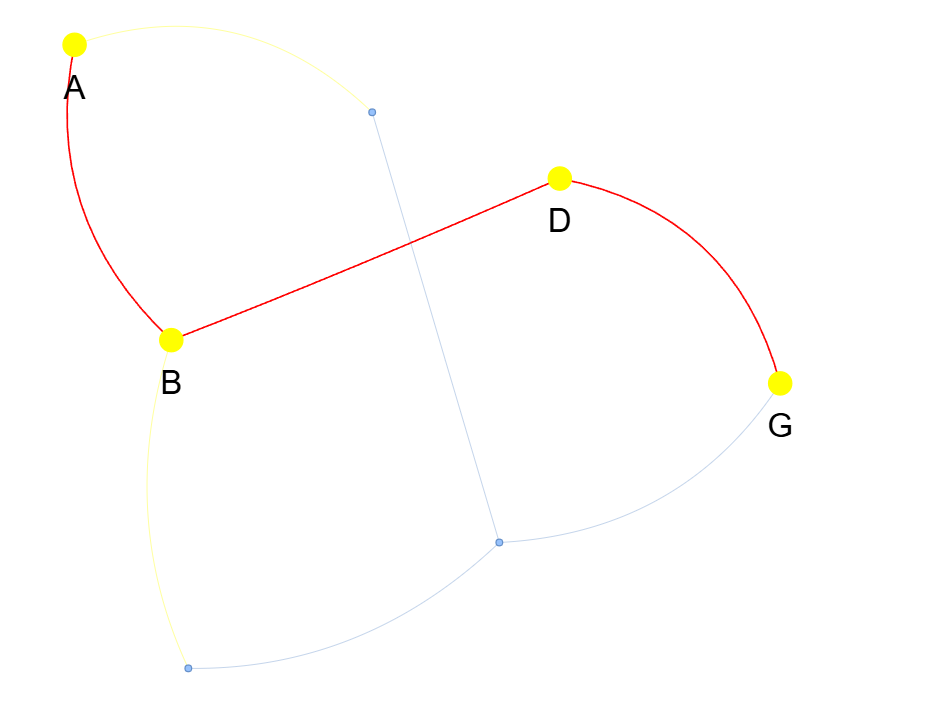

# 📚 ALP Discrete Mathematics Semester 3 - Program Analisis Graf

Program pembelajaran interaktif untuk memahami konsep **Graf (Graph)** dalam Matematika Diskrit dengan visualisasi dan analisis mendalam.

---

## 📋 Daftar Isi
1. [Cara Kerja](#cara-kerja)
2. [Apa Saja yang Ada](#apa-saja-yang-ada)
3. [Kegunaan dari Kode](#kegunaan-dari-kode)

---

## 🔧 Cara Kerja

### Alur Program Utama

Program ini bekerja dengan sistem **menu interaktif** yang memandu pengguna melalui berbagai operasi graf:

```
START
  ↓
[Menu Utama]
  ├── Soal 1: Graf Tak Berarah
  │    ├── Input nodes (V) dan edges (E)
  │    ├── Visualisasi graf
  │    ├── Analisis derajat setiap node
  │    ├── Deteksi cycle
  │    └── Cek apakah graf connected
  │
  ├── Soal 2: Graf Berbobot
  │    ├── Input nodes dan weighted edges
  │    ├── Visualisasi graf berbobot
  │    ├── BFS (Breadth-First Search)
  │    ├── DFS (Depth-First Search)
  │    └── Dijkstra's Algorithm (Shortest Path)
  │
  └── [Exit]
```

### Komponen Utama

#### 1. **GraphClass.py** (Kelas Graf)
- **Inisialisasi**: Membuat graph directed atau undirected menggunakan NetworkX
- **Add Nodes**: Menambahkan simpul dengan support tipe data (String, Integer, Float)
- **Add Edges**: Menambahkan sisi dengan atau tanpa bobot
- **Analisis Graph**:
  - `get_node_degree()` → Menghitung derajat setiap node
  - `find_cycles()` → Mendeteksi cycle dalam graf
  - `is_connected()` → Mengecek konektivitas graf
  - `bfs()` → Traversal Breadth-First Search
  - `dfs()` → Traversal Depth-First Search (Rekursif)
  - `dijkstra()` → Algoritma Dijkstra untuk shortest path
- **Visualisasi**: Menggunakan PyVis untuk membuat HTML interactive visualization

#### 2. **AnotherClass.py** (Kelas Tambahan)
- Menyediakan utility functions untuk:
  - Input validation
  - Data formatting
  - Helper functions untuk analisis tambahan

#### 3. **Soal1.py** (Study Case 1 - Graf Tak Berarah)
- **Kasus**: Diberikan graf `G = (V, E)` dengan 6 simpul (A-F) dan 7 sisi
- **Analisis**:
  - Menghitung derajat setiap simpul
  - Menemukan cycle dalam graf
  - Menentukan konektivitas graf
- **Output**: Visualisasi HTML dan hasil analisis di terminal

#### 4. **Soal2.py** (Study Case 2 - Graf Berbobot)
- **Kasus**: Diberikan graf berbobot dengan 7 simpul (A-G) dan weighted edges
- **Analisis**:
  - BFS traversal dari simpul A
  - DFS traversal dari simpul A (dengan urutan alfabet)
  - Dijkstra algorithm untuk jalur terpendek A → G
- **Output**: Visualisasi HTML dan hasil analisis di terminal

#### 5. **main.py** (Program Utama)
- Menu interaktif untuk menjalankan kedua study case
- Menampilkan welcome screen dengan informasi program
- Navigasi antar soal dan opsi analisis

---

## 📁 Apa Saja yang Ada

### File Utama
```
├── main.py                          # Program utama dengan menu interaktif
├── GraphClass.py                    # Kelas untuk membuat dan analisis graf
├── AnotherClass.py                  # Kelas utility dan helper functions
├── Soal1.py                         # Study Case 1: Graf Tak Berarah (6 nodes)
├── Soal2.py                         # Study Case 2: Graf Berbobot (7 nodes)
└── README.md                        # File dokumentasi (file ini)
```

### File Output (HTML Visualization)
```
├── custom_weighted_graph.html       # Visualisasi graf berbobot custom
├── soal2_graf_visualisasi.html      # Visualisasi Soal 2 lengkap
└── soal2_shortest_path_A_to_G.html  # Visualisasi jalur terpendek Soal 2
```

### Library & Dependencies
```
lib/
├── bindings/
│   └── utils.js                     # JavaScript utilities
├── tom-select/
│   ├── tom-select.complete.min.js   # Tom Select library (dropdown)
│   └── tom-select.css               # Tom Select styling
└── vis-9.1.2/
    ├── vis-network.min.js           # Vis.js network visualization
    └── vis-network.css              # Vis.js network styling
```

### Dependencies Python
- **networkx** - Pembuatan dan analisis struktur graf
- **pyvis** - Visualisasi graf interaktif (HTML output)

---

## 🎯 Kegunaan dari Kode

### 1. **Pembelajaran Matematika Diskrit**
Program ini dirancang untuk membantu pemahaman konsep-konsep penting dalam Discrete Mathematics:
- **Teori Graf**: Definisi, representasi, dan properti graf
- **Graph Properties**: Degree, cycle, connected components
- **Graph Algorithms**: BFS, DFS, Dijkstra
- **Weighted Graphs**: Konsep bobot sisi dan shortest path

### 2. **Visualisasi Interaktif**
- Setiap graf ditampilkan dalam format HTML interaktif
- Pengguna dapat zoom, drag nodes, dan explore struktur graf
- Membantu pemahaman visual struktur data yang kompleks

### 3. **Analisis Otomatis**
Kode secara otomatis menghitung:
- **Derajat Simpul**: Jumlah sisi yang terhubung ke setiap node
- **Cycle Detection**: Menemukan semua cycle dalam graf
- **Konektivitas**: Mengecek apakah graf connected atau tidak
- **Shortest Path**: Menentukan rute terpendek dengan Dijkstra
- **Traversal Order**: Urutan kunjungan BFS dan DFS

### 4. **Study Cases Praktis**
- **Soal 1**: Menganalisis struktur graf sederhana (undirected, 6 nodes)
- **Soal 2**: Menyelesaikan masalah kompleks dengan graf berbobot (7 nodes, weighted edges)

### 5. **Flexible Graph Input**
Kode mendukung berbagai format input:
- Node identifier: String (`A`, `B`, `C`) atau Integer (`1`, `2`, `3`)
- Edge format: `(u, v)` untuk undirected atau `(u, v, weight)` untuk weighted
- Bobot dapat berupa integer atau float

### 6. **Terminal & Web Output**
- **Terminal Output**: Hasil analisis ditampilkan dalam format tabel dan teks
- **HTML Output**: Visualisasi interaktif disimpan sebagai file `.html`
- Auto-open di browser untuk kemudahan viewing

---

## 🚀 Cara Menggunakan

### 1. Install Dependencies
```bash
pip install networkx pyvis
```

### 2. Jalankan Program
```bash
python main.py
```

### 3. Pilih Menu
- Menu akan menampilkan opsi untuk Soal 1 atau Soal 2
- Ikuti prompt di terminal
- Output HTML akan otomatis dibuka di browser

### 4. Interpretasi Hasil
- Periksa visualisasi graf di browser
- Baca hasil analisis di terminal (degree, cycles, paths)
- Gunakan untuk belajar dan memahami konsep

---

## 📊 Contoh Output & Penjelasan Soal

### SOAL 1 - GRAF TAK BERARAH

#### 📋 Deskripsi Soal
Diberikan graf tak berarah `G = (V, E)` dengan:
- **V (Vertices)**: {A, B, C, D, E, F} - 6 simpul
- **E (Edges)**: {(A,B), (A,C), (B,D), (C,E), (D,E), (E,F), (C,F)} - 7 sisi

#### 🎯 Pertanyaan yang Dijawab
a. **Gambarkan Grafnya** - Visualisasi struktur graf  
b. **Derajat Setiap Simpul** - Berapa banyak sisi yang terhubung ke setiap node  
c. **Deteksi Cycle** - Menemukan sirkuit/loop dalam graf  
d. **Konektivitas** - Apakah semua simpul saling terhubung  

#### ✅ Contoh Output
```
======================================================================
                     SOAL 1 - GRAF TAK BERARAH
======================================================================

📋 Data Graf:
  V = {A, B, C, D, E, F}
  E = {(A,B), (A,C), (B,D), (C,E), (D,E), (E,F), (C,F)}

a. Gambarkan Grafnya
  Graf tak berarah telah divisualisasikan dan disimpan ke file: soal1_graf_visualisasi.html

b. Derajat Setiap Simpul:
  Simpul          Derajat
  -------         -------
  A               2
  B               2
  C               3
  D               2
  E               3
  F               2

c. Deteksi Cycle:
  Cycle ditemukan: ['A', 'B', 'D', 'E', 'C', 'A']
  Penjelasan: Terdapat sirkuit yang menghubungkan simpul A → B → D → E → C → A

d. Konektivitas Graf:
  ✓ Graf adalah CONNECTED (semua simpul saling terhubung)
```

#### 📌 Konsep yang Dipelajari
- **Derajat Simpul (Node Degree)**: Jumlah edge yang incident dengan simpul
- **Cycle Detection**: Menemukan path yang kembali ke simpul awal
- **Connected Graph**: Semua vertex dapat dicapai dari vertex lainnya
- **Undirected Graph**: Edge tidak memiliki arah (A-B sama dengan B-A)


---

### SOAL 2 - GRAF BERBOBOT

#### 📋 Deskripsi Soal
Diberikan graf berarah berbobot `G = (V, E)` dengan:
- **V (Vertices)**: {A, B, C, D, E, F, G} - 7 simpul
- **E (Edges)**: {(A,B,2), (A,C,5), (B,D,4), (B,E,6), (C,F,3), (D,G,2), (E,F,4), (F,G,1)}

#### 🎯 Pertanyaan yang Dijawab
a. **Gambarkan Grafnya** - Visualisasi struktur graf berbobot  
b. **BFS dari Simpul A** - Traversal menggunakan Breadth-First Search  
c. **DFS dari Simpul A** - Traversal menggunakan Depth-First Search (Rekursif)  
d. **Dijkstra Algorithm** - Mencari jalur terpendek dari A ke semua simpul dan khususnya ke G  

#### ✅ Contoh Output
```
======================================================================
                     SOAL 2 - GRAF BERBOBOT
======================================================================

📋 Data Graf:
  V = {A, B, C, D, E, F, G}
  E = {(A,B,2), (A,C,5), (B,D,4), (B,E,6), (C,F,3), (D,G,2), (E,F,4), (F,G,1)}

a. Gambarkan Grafnya
  Graf berbobot telah divisualisasikan dan disimpan ke file: soal2_graf_visualisasi.html

b. Tentukan Urutan Kunjungan Menggunakan BFS Dimulai dari Simpul A
  Urutan kunjungan BFS dari A:
    A → B → C → D → E → F → G
  
  Penjelasan:
    Level 0: A (start)
    Level 1: B (jarak 2 dari A), C (jarak 5 dari A)
    Level 2: D (jarak 4 dari B), E (jarak 6 dari B), F (jarak 3 dari C)
    Level 3: G (jarak 2 dari D)

c. Tentukan Urutan Kunjungan Menggunakan DFS (Rekursif)
   dengan Simpul Awal A dan Urutan Tetangga Berdasarkan Alfabet
  Urutan kunjungan DFS dari A:
    A → B → D → G → E → F → C
  
  Penjelasan:
    A → B (neighbor A, urutan alfabet)
    B → D (neighbor B, urutan alfabet)
    D → G (neighbor D)
    G (no more unvisited neighbors)
    Backtrack ke D, lalu ke B
    B → E (neighbor berikutnya dari B)
    E → F (neighbor E)
    F → (sudah visited, backtrack)
    Backtrack ke B, lalu ke A
    A → C (neighbor berikutnya dari A)
    C (sudah visited F, backtrack)

d. Gunakan Algoritma Dijkstra dari Simpul A untuk Menentukan:

  1. Jarak Minimum dari A ke Seluruh Simpul
  ------
  Simpul          Jarak dari A
  -------         -------
  A               0
  B               2
  C               5
  D               6
  E               8
  F               7
  G               8
  
  Penjelasan:
    A → A: 0 (start)
    A → B: 2 (direct)
    A → C: 5 (direct)
    A → D: 6 (via B: 2+4)
    A → E: 8 (via B: 2+6)
    A → F: 7 (via C: 5+3 atau via E: 8+4? min=7)
    A → G: 8 (via D: 6+2)

  2. Jalur Terpendek dari A ke G
  ------
  Jalur terpendek dari A ke G:
    A → B → D → G
  Jarak total: 8
  
  Penjelasan:
    Langkah 1: A → B (bobot 2)
    Langkah 2: B → D (bobot 4)
    Langkah 3: D → G (bobot 2)
    Total: 2 + 4 + 2 = 8
  
  Visualisasi jalur terpendek disimpan ke: soal2_shortest_path_A_to_G.html
```


#### 📌 Konsep yang Dipelajari
- **Weighted Graph**: Setiap edge memiliki nilai/bobot (cost, distance, weight)
- **BFS (Breadth-First Search)**: Traversal level-by-level, cocok untuk shortest path tanpa bobot
- **DFS (Depth-First Search)**: Traversal depth-first, menggunakan rekursi atau stack
- **Dijkstra's Algorithm**: Algoritma greedy untuk mencari shortest path di weighted graph
- **Shortest Path**: Path dengan total bobot minimum antara dua vertex

---

### HTML Visualization
- **Soal 1**: File `soal1_graf_visualisasi.html`
  - Nodes ditampilkan dengan label (A, B, C, D, E, F)
  - Edges ditampilkan dengan garis
  - Layout otomatis dengan physics simulation
  - Interactive: zoom, drag nodes, hover untuk info

- **Soal 2**: File `soal2_graf_visualisasi.html`
  - Nodes ditampilkan dengan label (A, B, C, D, E, F, G)
  - Edges ditampilkan dengan label bobot
  - Layout otomatis dengan physics simulation
  - Interactive: zoom, drag nodes, hover untuk info bobot
  
- **Soal 2 Shortest Path**: File `soal2_shortest_path_A_to_G.html`
  - Visualisasi jalur terpendek dari A ke G
  - Highlight path dengan warna berbeda
  - Menampilkan bobot setiap edge dalam path

---

## 📝 Catatan Penting

1. **Python Version**: Gunakan Python 3.7+
2. **Internet Access**: Diperlukan untuk membuka HTML files di browser
3. **Node Identifier**: Dapat berupa kombinasi string dan angka (e.g., `A1`, `Node2`)
4. **Graph Type**: 
   - Undirected: Untuk Soal 1
   - Directed/Weighted: Untuk Soal 2

---

## 🎓 Materi Pembelajaran

Setiap bagian program mengajarkan:
- **Basic Graph Theory**: V, E, degree, edges, vertices
- **Graph Traversal**: BFS & DFS algorithms
- **Shortest Path**: Dijkstra's algorithm
- **Graph Properties**: Connectivity, cycles
- **Visualization**: Mewujudkan teori menjadi visual

---

**Created for**: ALP (Algoritma dan Pemrograman) - Discrete Mathematics Semester 3
**Status**: Educational Project ✓
